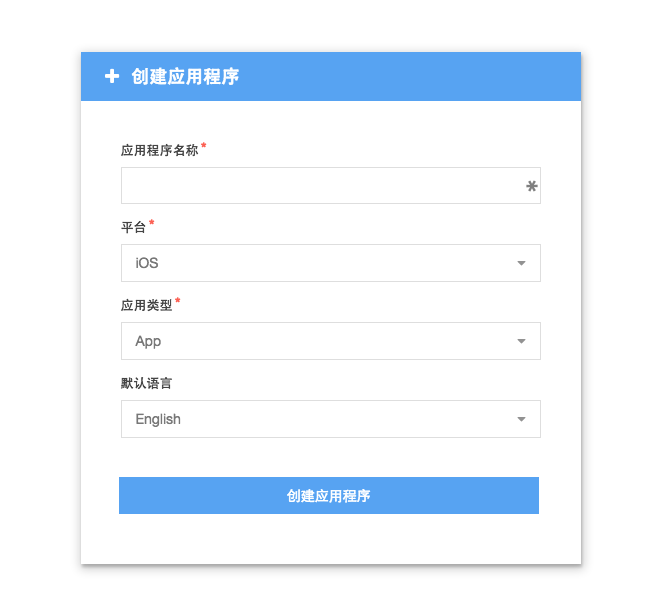
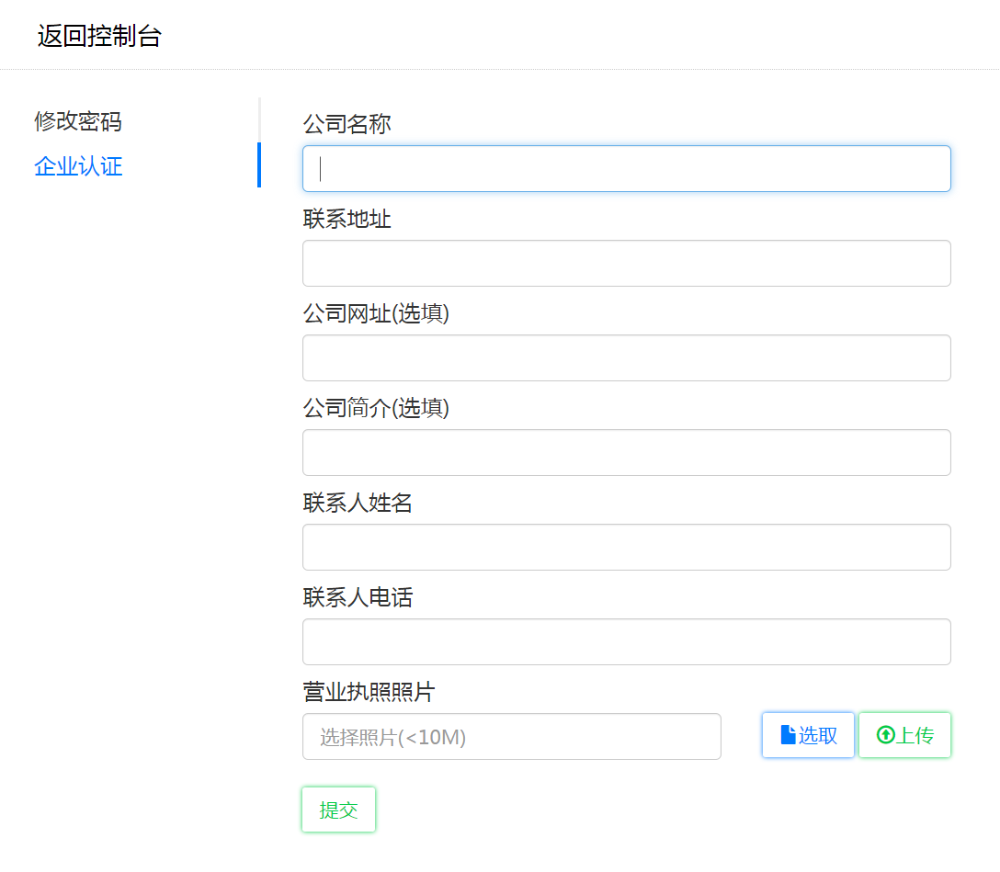

##支付使用流程

####登录进入控制台（未注册MaxLeap用户先进行注册）。
####添加新应用

####填写企业认证

####配置支付渠道参数
参考微信、支付宝支付设置
####选择开发平台语言下载SDK
 https://maxleap.cn/zh_cn/guide/devcenter.html

##支付流程

其中需要开发者开发的有

步骤1（在客户移动应用端）发送支付要素
做完这一步之后就会跳到相应的支付页面（如微信app中），让用户继续后续的支付步骤

步骤5（在客户移动应用端）处理同步回调结果
付款完成或取消之后，会回到客户app中，需要做相应界面展示的更新（比如弹出框告诉用户"支付成功"或"支付失败")。

步骤7：（在客户服务器端）处理异步回调结果（Webhook）
付款完成之后，根据客户在MaxLeap后台的设置，MaxLeap会向客户服务端发送一个Webhook请求，里面包括了数字签名，订单号，订单金额等一系列信息。客户需要在服务端依据规则要验证数字签名是否正确，购买的产品与订单金额是否匹配，这两个验证缺一不可。验证结束后即可开始走支付完成后的逻辑。